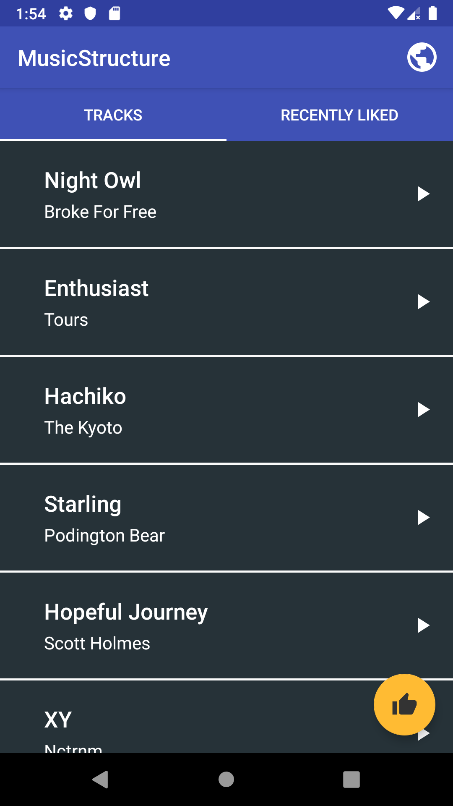
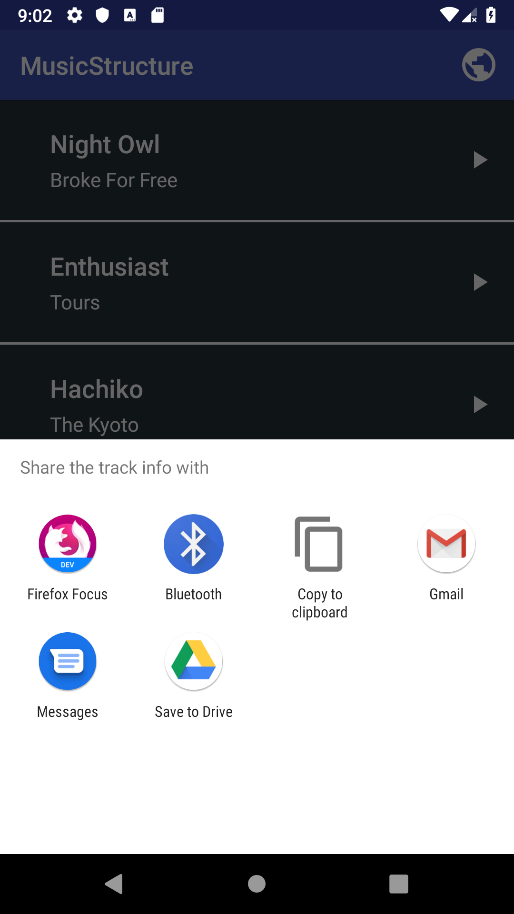

# MusicStructure
It is an android music player application that fetches and plays the music content from the urls provided in the code.

**The application doesn't seek music files from device storage.**

## Getting Started
Import the project in Android Studio and compile and run it on an android device or emulator. There are some tracks that are initially present in the application that can be played or the track list can be edited in MainActivity class. **The application requires access to the Internet to fetch and play music from the provided URLs.**

### Prerequisites
* Android Studio
* Java Development Kit
* Android device or emulator running on at least Android 4.0.3
* Internet Access

## Screenshots
&nbsp; &nbsp; &nbsp; &nbsp; 

## APIs used
* [MediaPlayer](https://developer.android.com/reference/android/media/MediaPlayer) - Used to play tracks
* [AudioManager](https://developer.android.com/reference/android/media/AudioManager) - Handle audio focus

## Tracks
I do not own the tracks present in the application. I have used some the tracks from the following artists:
* [Broke For Free](http://freemusicarchive.org/music/Broke_For_Free/)
* [Tours](http://freemusicarchive.org/music/Tours/)
* [The Kyoto Connection](http://freemusicarchive.org/music/The_Kyoto_Connection/)
* [Podington Bear](http://freemusicarchive.org/music/Podington_Bear/)
* [Scott Holmes](http://freemusicarchive.org/music/Scott_Holmes/)
* [Nctrnm](http://freemusicarchive.org/music/Nctrnm/)

## Authors
* [Sijan Rijal](https://github.com/sijanr)

## License
See the [LICENSE](./LICENSE) for details
